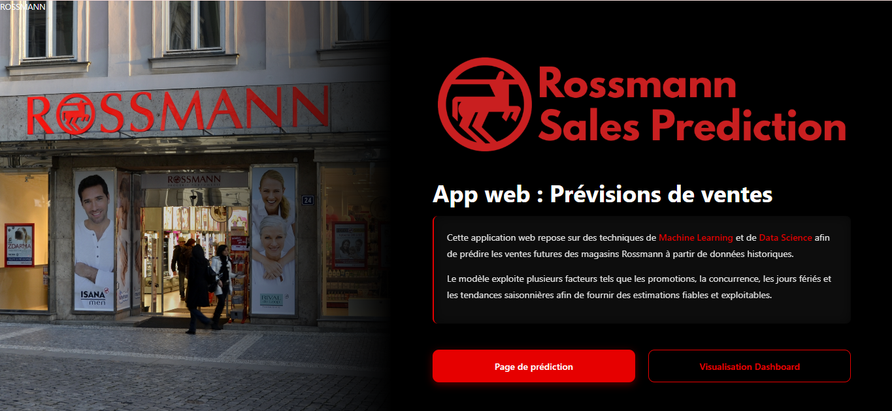
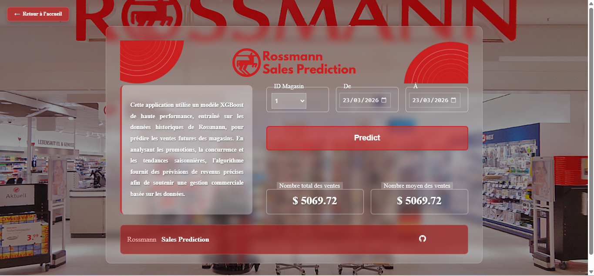
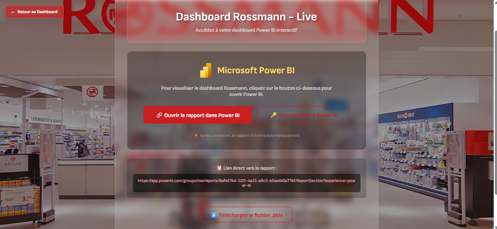
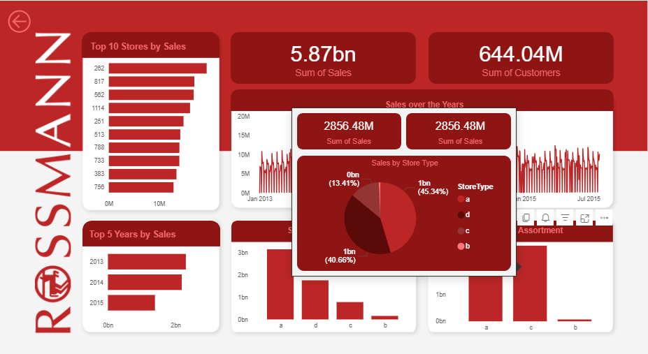
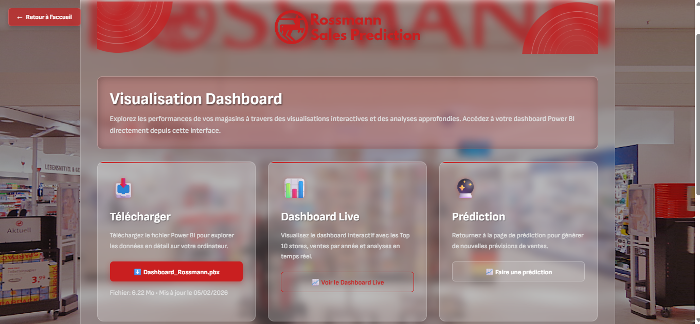

# 📊 Rossmann Sales Prediction & Analytics 

## 📝 About the Project
This project consists of a complete sales analysis and forecasting solution for the **Rossmann** chain of stores. The application combines the power of **Machine Learning** for revenue forecasting and **Business Intelligence** for strategic management.

---

## 🚀 Main Features

### 1. Sales Forecasting (Machine Learning)
The application integrates an **XGBoost** model trained on Rossmann's historical data. 
* **Multi-factor analysis:** Takes into account promotions, competition, holidays and seasonality.
* **Custom predictions:** Ability to generate forecasts by store and by specific period.

### 2. Visualization & Dashboarding
A section dedicated to data analysis (BI) via **Microsoft Power BI**:
* **Live Dashboard:** Real-time consultation of KPIs (Turnover, number of customers).
* **Comparative Analysis:** Ranking of the best stores (Top 10) and annual evolution.
* **Export:** Access to the source `.pbix` file for offline analysis.

---

## 🛠️ Technologies Used

* **Backend:** Python 3.10
* **Modeling:** XGBoost (Gradient Boosting Algorithm)
* **Web Interface:** Flask/Django
* **Data Visualization:** Microsoft Power BI
* **Version Control:** Git & GitHub

---

## 📸 Interface Preview

### 🏠 Home Page
Interface intuitive permettant de naviguer entre le module de prédiction et le tableau de bord analytique.

### 🔮 Prediction Module
Interface de saisie pour l'algorithme XGBoost affichant les ventes totales et moyennes prévues.

### 📈 Analytical Dashboard
Visualisations interactives incluant la répartition des ventes par type de magasin et par année.

### 📥 Download Section
Section permettant de consulter le dashboard en mode Live ou de télécharger le rapport complet.

## 👤 Author
Soufia BELKADI Data Engineering Student
